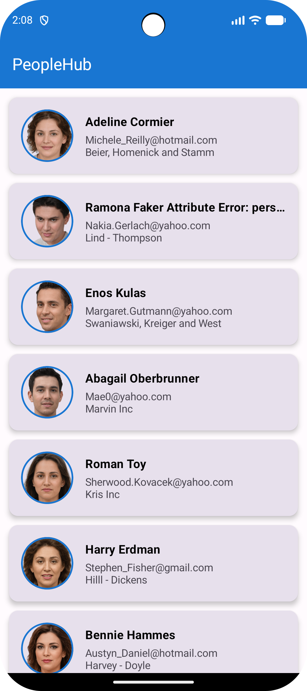

# PeopleHub

PeopleHub is a simple Android application built using Jetpack Compose that displays a list of users fetched from a public API and shows detailed user information.

---

## Features

- User list screen
- User detail screen
- API integration using Retrofit
- Dependency Injection using Hilt
- MVVM architecture
- Coroutines for async operations
- Loading indicator
- Profile image support
- Unit test included

---

## Tech Stack

- Kotlin
- Jetpack Compose
- Hilt
- Retrofit
- Coroutines
- MVVM
- Coil
- Navigation Compose

---

## Project Structure

```text
data/
network/
repository/
ui/
navigation/
```

---

## Screenshots

### User List



### User Details


---

## Demo Video

[Download Demo Video](screenshots/PeopleHub-Demo-Video.mp4)

---

## Improvements

- Pagination
- Search functionality
- Offline caching using Room
- UI tests
- Better error handling

---

## API Used

https://fake-json-api.mock.beeceptor.com/users
